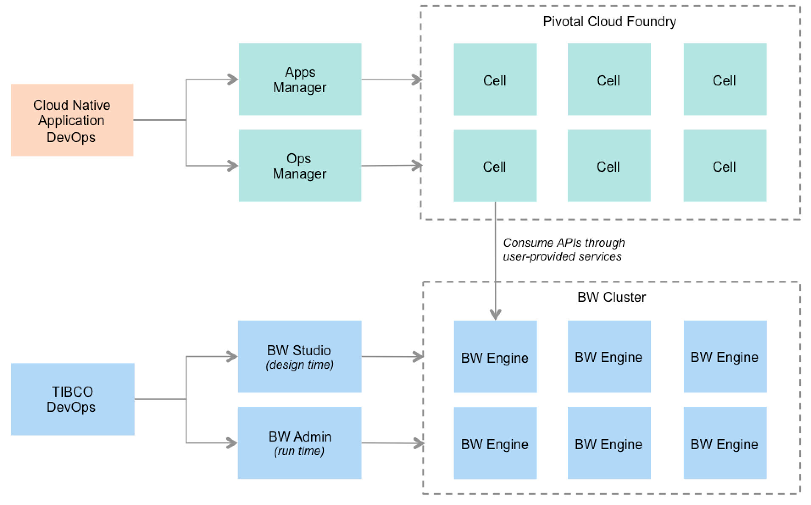
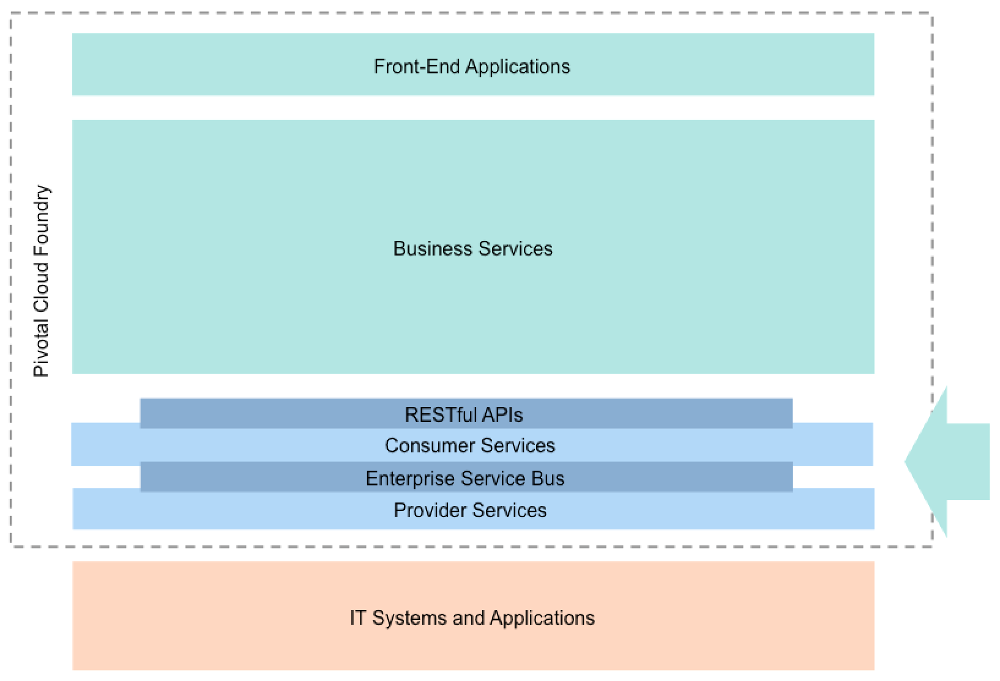
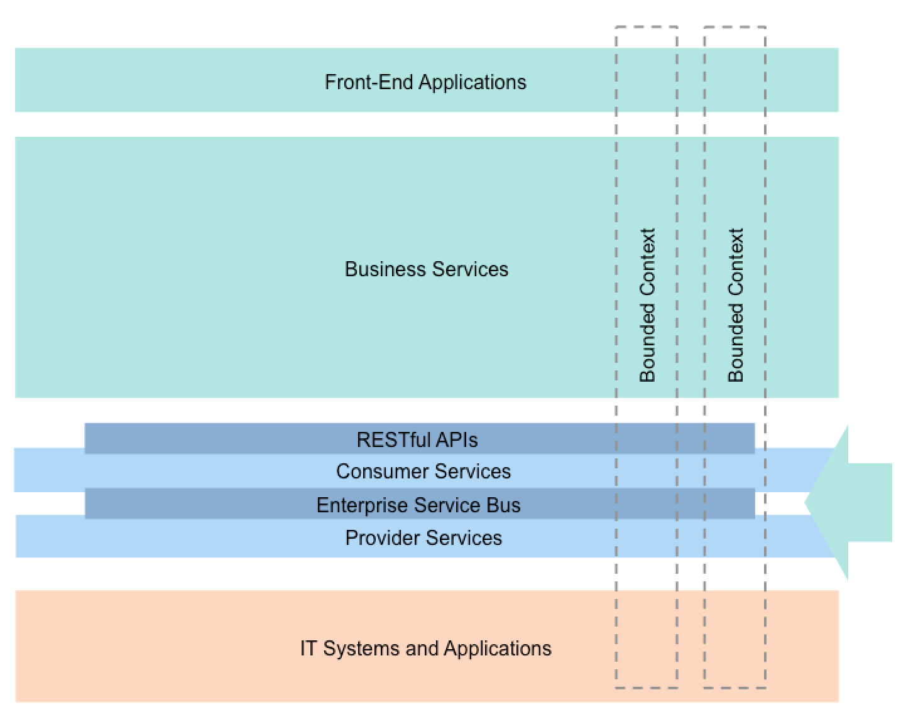

# Evolution of the ESB to the Cloud

## Background
The rising popularity of microservices as an architecture has led to several questions around the role of the ESB. Traditionally the role of the ESB was to fulfill the promise of SOA by providing invocation, routing, mediation, messaging, process choreography, service orchestration, complex event processing, management, agnosticism, support for various message exchange patterns, adapters, transformation, validation, governance, enrichment and abstraction. One can easily see how such a software can easily become the central bottleneck for all things enterprise aka the God object. The microservices approach favors dumb pipes and smart endpoints whereas an ESB works on an canonical data representation leading to dumb endpoints and smart pipes. There is an inherent conflict between microservices and ESBs. An ESB centric app architecture results in anemic or dumb services that are integrated via a smart centralized ESB.

## Why Microservices
The rise of platforms like Cloud Foundry, OpenShift, DIY PaaS and the Docker ecosystem has led to the citizen model of integration. The emergence of these platforms is a direct consequence of the need for reduced business and software time to value. Features need to be delivered in a time span of weeks instead of years. 3rd generation platforms make this possible by baking into their foundation microservice management capabilities like service discovery, routing, load balancing, application life cycle management and operational capabilities like canary releases, zero downtime deployment,automation, monitoring and security. Many of the concerns taken care of the ESB are now usurped by the PaaS and provided to all the applications transparently at web scale. Moreover these platforms are truly open to extension and can be deployed using next generation tooling with BOSH, Ansible etc.

## People & Process
A successful deployment of microservices is contingent on people, process and technology. The development of microservices is done with the agile methodology. The roots of agile can be found in Mel Conway's seminal work "How Do Committees Invent" [mel-conway](http://www.melconway.com/Home/Committees_Paper.html) in 1967.
 1. Conway's First Law: A system’s design is a copy of the organization’s communication structure.
Conway's first law tells us TEAM SIZE is important. Communication dictates design. Make the teams as small as necessary.
 2. Conway's Second Law: There is never enough time to do something right, but there is always enough
time to do it over.
Conway's second law tells us PROBLEM SIZE is important. Make the solution as small as necessary.
 3. Conway's Third Law: There is a homomorphism from the linear graph of a system to the linear graph of
its design organization
Conways Third law tells us CROSS-TEAM INDEPENDENCE is imporant.
 4. Conway's Fourth Law: The structures of large systems tend to disintegrate during development, qualitatively more so than with small systems.
Conways fourth law tells us that TIME is against LARGE teams therefore it is critical to make release cycles short and small.

The ESB development model of design by committee is at odds with the fundamental tenets of agile and lean development i.e. smaller decentralized teams and faster release cycles. ESB development requires specialized knowledge and does not support rapid continous development.

## Challenges With Microservices

When a business system is designed as a suite of microservices that prefer choreography over orchestration it behooves the advocates of the architecture to provide best practices and pattern to implement the abstraction. This is where microservices falls short. The programming frameworks for microservices choreography such as event sourcing and CQRS are woefully behind in terms of maturity and production capability with some notable exceptions like [akka-persistence](http://doc.akka.io/docs/akka/snapshot/scala/persistence.html).

An ESB provides a visual mode of development that allows domain modelers and business developers an opportunity to design and validate a business process without getting their hands dirty with code. A cross-bar architecture allows architects to enforce a central point of governance and control over design and implementation. DIY Integration frameworks lack the extensive user and process modeling tools that traditional ESB vendors provide. This is a shortcoming in the DIY Integration ecosystem with Spring Integration and Apache Camel.

Features of the ESB like business activity monitoring and event correlation now have to be implemented in applications or supplied as cross-cutting libraries to applications. ESB has a whole suite of connector services and adaptors that will need to plugged in for an individual service instead of harvesting from a common core.

A mature enterprise has a fully developed and very mature suite of ESB services that makes development of features ESBs easy and fast. The pain of development, training and deployment has been amortized over the years to the point where developing features with the ESB may be equivalent to writing a suite of microservices.

## Migration from ESBs to Cloud Native Platforms:

There are 5 phases to evolving an ESB infrastructure and accompanying business services to the cloud.

## Phase 0
Deploy the ESB alongside the PaaS. ESB services are exposed as user provided external services to the PaaS. This allows the enterprise to deploy apps to a platform like Cloud Foundry and keep its existing backend services in an ESB like TIBCO. The advantages here is the ability to move the web tier to the next generation platform without disrupting existing integration flows.

## Phase 1
Deploy the ESB in the PaaS. Increasingly ESB vendors have moved their offerings to the cloud. See [TIBCO Business Works Cloud Foundry Edition](http://www.tibco.com/company/news/releases/2015/tibco-prioritizes-the-cloud-with-debut-of-two-new-integration-platforms) or [mulesoft iPaaS](https://www.mulesoft.com/resources/cloudhub/ipaas-integration-platform-as-a-service). In fact Gartner defines this as a entirely new category called iPaaS i.e. a suite of cloud services enabling development, execution and governance of integration flows connecting any combination of on premises and cloud-based processes, services, applications and data within individual or across multiple organizations.

The Cloud Foundry edition of TIBCO allows individual TIBCO business processes to be natively scaled and managed by Cloud Foundry. From a Cloud Foundry perspective the TIBCO business process is treated as a new language with its own buildpack. This is a reasonable middle ground between ESBs and Microservices. There are two issues with a cloud enabled ESB like TIBCO, the ESB needs to leverage native messaging capabilities (like FTL) that are not available natively in the PaaS. The ESB needs to leverage the managed data backing services natively available on the platform.

## Phase 2
A refactoring of the services offered by the ESB such that the ESB layer is kept as thin as possible. At this point there are many opportunities to migrate from the ESB to Spring Integration/Apache Camel to achieve basic transformation, mediation, and routing. Consumer Services Expose APIs with formats/protocols desired by consumers. Consumer services transform formats provide sync/async, protocols and composite workflows. Provider Services integrate with legacy IT systems, implement required workflow and consume whatever protocol/format is exposed by legacy systems. Refactor services incrementally per bounded context, prioritizing the ones that are new or under active development.

Standardize consumer APIs over REST/JSON and reduce the cross-bar architecture complexity by not entertaining a variety of consumer preferences. Extend bounded contexts to include legacy app dependencies. For high performance data intensive workloads the cost of serialization/deserialization of messages from the enterprise bus may be too high. Consider a binary serialization mechanism like google protocol buffers or Kyro for internal messaging, APIs, caching, etc across services.

## Phase 3

Replacement of ESB services using integration pattern frameworks like Spring Cloud Stream and Apache Camel. Spring Integration and its cloud successor Spring Cloud Stream provide successively higher layers of abstraction making it possible to write ESB flows and function using cloud native architectural constructs leveraging annotations and interfaces to specify business function. Spring Cloud Stream is a combination of Spring Cloud, Spring Boot and Spring Integration where integration modules are Spring Boot apps. The plumbing of putting together channel adapters and flows over message brokers like Kafka and RabbitMQ is done intelligently by the platform.  The citizen integration framework be it apache camel or Spring Integration provides developers a familiar java developer's way to compose and operate on services. This approach does not rely on IDE tools to design the services and an additional step to deploy. Development of integration services is the same as development of any other business logic which eliminates the traditional impedance mismatch associated with ESBs and allows for a faster iteration of feature code.

One language (Java), one runtime (Tomcat) and one CI/CD process  results in the holy grail of reduced time to value and increased efficiency. Both Apache Camel and Spring Integration have a vast number of [components](http://camel.apache.org/components.html), modules and [adapters](http://docs.spring.io/spring-integration/reference/htmlsingle/) to legacy systems that can aid in this transformation. REST APIs from zConnect should be leveraged natively on the mainframe where possible ditching the man-in-middle legacy adapter layer if possible. [z/OS Connect](http://www-01.ibm.com/support/docview.wss?uid=tss1wp102439) enables z/OS systems such as CICS and IMS to provide RESTful APIs and accepts transactional JSON payloads via the WebSphere Liberty app server.

## Phase 4

After phase 2 and 3 you are leveraging a lot of Integration patterns aka EAI constructs. Phase 4 is doing away with EAI patterns and leveraging a pure event driven messaging architecture. Decomposition of ESB integration services based on business criteria to higher order vertically sliced domain based service. The intent is to make the service independent. The service provides a smart endpoint. The service fulfills a contract for a bounded context and is complete in all respects.  Process orchestration is replaced by choreography. The Spring Cloud framework provides an umbrella of Netflix OSS tools that should be used when  writing distributed systems. The service implemented with the help of Spring cloud and the platform are responsible for providing all the qualities of service provided earlier by the ESB. A fabric of independently operating coarsely grained microservices that are choreographed to achieve business function is the ultimate manifestation of the Domain Driven microservice philosophy.

In a choreography approach the central controller service is replaced by the asynchronous flow of events over a message bus. These events are picked up by interested services and appropriate actions are taken which maybe message enrichment, transformation, etc,. Since business process flows are now transformed to event and activity flows, business activity monitoring becomes critical. Compensation of failed transactions and exception actions should be incorporated into business logic. A user journey now becomes a series of async interactions. Additional work is needed to ensure that you can monitor and track that the right things have happened.

---

## TL;DR Recommendations for Citi-Group

1. Generation of UI components for responsive design should be done on the server side using Spring Web MVC and next generation service template technologies like JHipster for Angular.js. Citi will benefit from a relatively dumb UI and heavily templated responsive design libraries. The recommendation here is for them to stick to industry standard web stack generators like Yeoman, JHipster and [HTML5-Boilerplate](https://github.com/h5bp/html5-boilerplate). Follow the Netflix model of adapting device response at the edge tier using a software API proxy like Zuul. An application client, such as a native mobile application, could make RESTful HTTP requests to the individual services. On the surface this might seem attractive. However, there is likely to be a significant mismatch in granularity between the APIs of the individual services and data required by the clients. A much better approach is for clients to make a small number of requests per-page to an API gateway.

2. Where a comprehensive suite of ESB services already exist, follow a phased approach to migrating ESB composite and provider services. Business logic should reside in java apps and only fundamental ESB functions like legacy adapters and pure transformation and mediation should be handled by the ESB. Phase 1 is short term, Phase 2 & 3 is medium term and Phase 4 should be the target for longer term transformation.

3. Where existing ESB services do not already exist, start greenfield net new development with a pure microservices based approach. This will accelerate development to target state and generate a collateral of slimmed down domain based replaceable and reusable cloud native services. Support for horizontal concerns will be provided by Cloud Foundry. Integration concerns will be handled by implementing the app with Spring technologies and forward looking design patterns like CQRS and event sourcing.

4. Create sample business process, and app code repositories as well as an internal knowledge base around technologies like Spring Integration, Spring Data, Spring Cloud and Spring Batch. As developers start writing apps on cloud native platforms they need to be equipped in understanding the tradeoffs in writing distributed systems at scale otherwise the result will be distributed balls of mud.

---
